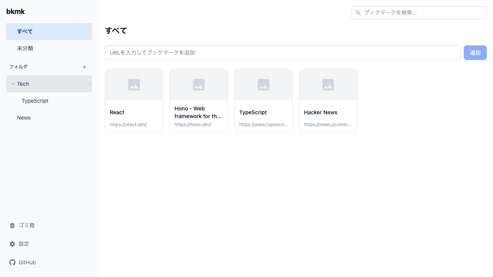

<div align="center">

# bkmk

### 気になったページを、すぐ保存。

URL をフォルダで整理し、OGP プレビュー付きで管理できるブックマークマネージャー

[Web アプリ](https://bkmk.tokyo) | [CLI](https://www.npmjs.com/package/@bkmk/cli)

</div>



<br />

## はじめる

### Web アプリ

[bkmk](https://bkmk.tokyo) にアクセスしてアカウントを作成するだけで、すぐに使い始められます。

### CLI

```bash
npm install -g @bkmk/cli
```

```bash
bkmk login                              # ログイン
bkmk add <url>                          # ブックマークを追加
bkmk ls [path]                          # フォルダ・ブックマーク一覧
bkmk search <keyword>                   # 検索
bkmk mkdir <path>                       # フォルダ作成
bkmk mv <id> <path>                     # 移動
bkmk open <id>                          # ブラウザで開く
bkmk rm <id>                            # ゴミ箱へ
bkmk trash                              # ゴミ箱一覧
bkmk restore <id>                       # 復元
bkmk rm <id> --force                    # 完全削除
```
